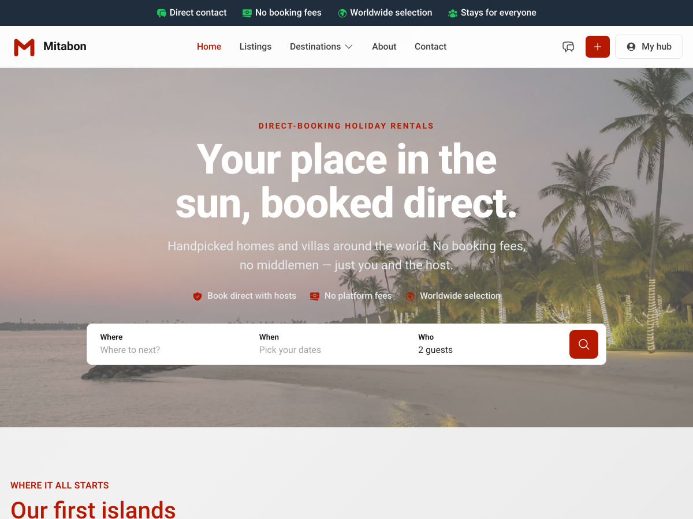

# Contabai Theme

Public site shell for the Contabai property-listings platform: header, top bar, homepage with hero and sections, footer and blog templates. Pairs with the [Contabai plugin](https://github.com/newmediacrew/contabai-plugin), which supplies the search, listings and guest pages.

## Requirements

- WordPress 7.1 or newer
- PHP 8.3 or newer
- The Contabai plugin (for search, listings and the guest pages)

## Installation

1. Download `contabai-theme.zip` from the latest [release](https://github.com/newmediacrew/contabai-theme/releases/latest).
2. In wp-admin: **Appearance → Themes → Add New → Upload Theme**, choose the zip, install and activate.
3. Go to **Contabai Theme** in the admin menu to set branding, hero, top bar, fonts, background, footer and socials.

## Settings

Branding · Hero · Top bar · Typography · Background · Footer · Socials · Updates · Advanced

Fonts are self-hosted: no requests to Google.

## Updates

New versions appear in **Dashboard → Updates** like any other theme. **Development mode** (Advanced tab) switches this off for a development copy.

## Languages

English, Dutch, German, Spanish, French and Portuguese.

## Licence

GPLv2 or later, see [LICENSE](LICENSE). Not covered by that licence:

- Photos in `assets/img/` (hero, islands, host) are from [Pexels](https://www.pexels.com/license/) under the Pexels License.
- Fonts in `assets/fonts/` keep their own licences, listed in [assets/fonts/LICENSES.md](assets/fonts/LICENSES.md) (SIL Open Font License 1.1 and Ubuntu Font Licence 1.0).
